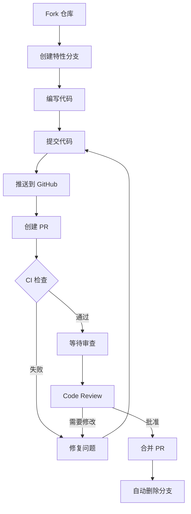
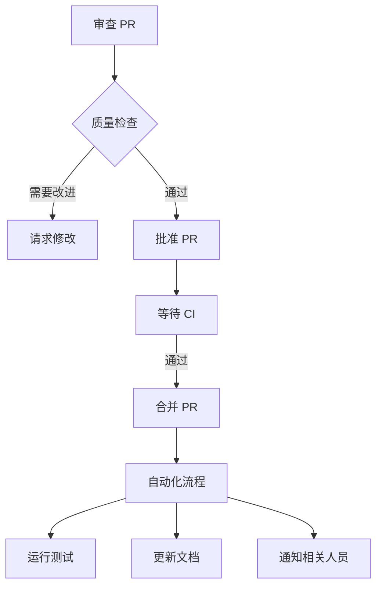
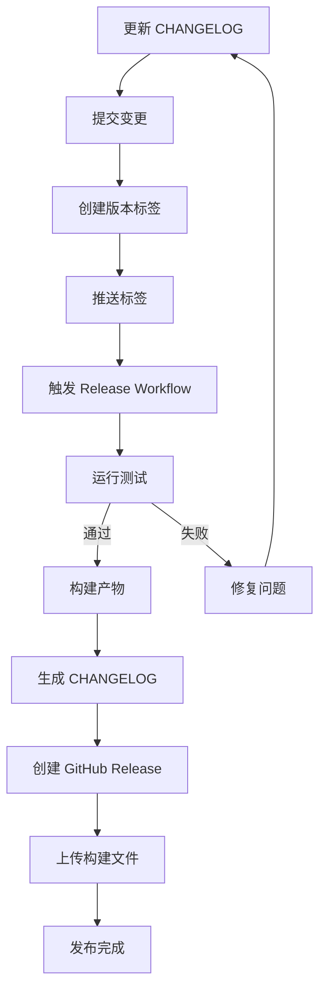

# GitHub 配置目录

本目录包含了 GitHub 仓库的所有自动化配置和文档。

## 📁 目录结构

```
.github/
├── workflows/              # GitHub Actions workflows
│   ├── ci.yml             # 持续集成
│   ├── codeql.yml         # 代码安全扫描
│   ├── pr-checks.yml      # PR 检查
│   ├── lint-pr-title.yml  # PR 标题验证
│   ├── release.yml        # 自动发布
│   ├── dependency-review.yml  # 依赖审查
│   ├── auto-merge.yml     # 自动合并
│   ├── stale.yml          # 过期管理
│   ├── link-check.yml     # 链接检查
│   ├── issue-metrics.yml  # 指标报告
│   └── greetings.yml      # 欢迎消息
├── ISSUE_TEMPLATE/        # Issue 模板
│   ├── bug_report.yml     # Bug 报告
│   └── feature_request.yml # 功能请求
├── PULL_REQUEST_TEMPLATE.md  # PR 模板
├── CONTRIBUTING.md        # 贡献指南
├── CODE_OF_CONDUCT.md    # 行为准则
├── SECURITY.md           # 安全政策
├── SUPPORT.md            # 获取支持
├── SETUP.md              # 仓库设置指南
├── AUTOMATION_SUMMARY.md # 自动化总结
├── CODEOWNERS            # 代码审查责任人
├── AUTO_ASSIGN.yml       # 自动分配审查者
├── dependabot.yml        # Dependabot 配置
├── labeler.yml           # 自动标签规则
├── markdown-link-check-config.json  # 链接检查配置
└── README.md             # 本文件
```

## 🚀 快速导航

### 文档

- **[AUTOMATION_SUMMARY.md](AUTOMATION_SUMMARY.md)** - 📖 自动化配置完整总结（**从这里开始**）
- **[SETUP.md](SETUP.md)** - ⚙️ GitHub 仓库设置指南
- **[CONTRIBUTING.md](CONTRIBUTING.md)** - 🤝 如何贡献代码
- **[SUPPORT.md](SUPPORT.md)** - 💬 如何获取帮助
- **[SECURITY.md](SECURITY.md)** - 🔒 安全政策和漏洞报告
- **[CODE_OF_CONDUCT.md](CODE_OF_CONDUCT.md)** - 📜 社区行为准则

### 配置文件

- **[dependabot.yml](dependabot.yml)** - 依赖自动更新
- **[CODEOWNERS](CODEOWNERS)** - 代码审查责任人
- **[labeler.yml](labeler.yml)** - 自动标签规则
- **[AUTO_ASSIGN.yml](AUTO_ASSIGN.yml)** - 自动分配审查者

### Workflows

- **[ci.yml](workflows/ci.yml)** - 持续集成流程
- **[release.yml](workflows/release.yml)** - 自动发布流程
- **[pr-checks.yml](workflows/pr-checks.yml)** - PR 自动检查

## 📋 功能清单

### ✅ 已配置功能

- [x] 持续集成 (CI/CD)
  - [x] Backend 测试和 Lint
  - [x] Frontend 测试和 Lint
  - [x] E2E 测试
  - [x] 代码覆盖率报告
  - [x] 构建验证
- [x] 代码质量
  - [x] CodeQL 安全扫描
  - [x] 依赖审查
  - [x] 许可证检查
- [x] PR 自动化
  - [x] 标题验证
  - [x] 大小检查
  - [x] 冲突检测
  - [x] 自动标签
  - [x] 描述检查
- [x] 依赖管理
  - [x] Dependabot 自动更新
  - [x] 自动合并安全更新
  - [x] 分组更新策略
- [x] 发布管理
  - [x] 自动构建
  - [x] 创建 Release
  - [x] 生成 CHANGELOG
  - [x] 上传构建产物
- [x] 维护自动化
  - [x] 过期 Issue/PR 管理
  - [x] 链接检查
  - [x] 月度指标报告
  - [x] 欢迎新贡献者
- [x] 文档和模板
  - [x] Issue 模板
  - [x] PR 模板
  - [x] 贡献指南
  - [x] 安全政策

## 🎯 推荐阅读顺序

如果你是第一次接触这个项目的自动化配置：

1. **[AUTOMATION_SUMMARY.md](AUTOMATION_SUMMARY.md)** - 了解整体自动化方案
2. **[SETUP.md](SETUP.md)** - 配置 GitHub 仓库设置
3. **[CONTRIBUTING.md](CONTRIBUTING.md)** - 学习如何贡献代码
4. **[workflows/ci.yml](workflows/ci.yml)** - 了解 CI 流程细节

如果你想要贡献代码：

1. **[CONTRIBUTING.md](CONTRIBUTING.md)** - 贡献指南
2. **[SUPPORT.md](SUPPORT.md)** - 获取帮助
3. **[ISSUE_TEMPLATE/](ISSUE_TEMPLATE/)** - Issue 模板
4. **[PULL_REQUEST_TEMPLATE.md](PULL_REQUEST_TEMPLATE.md)** - PR 模板

如果你是项目维护者：

1. **[SETUP.md](SETUP.md)** - 完整的仓库设置指南
2. **[CODEOWNERS](CODEOWNERS)** - 配置代码审查责任人
3. **[dependabot.yml](dependabot.yml)** - 调整依赖更新策略
4. **[workflows/](workflows/)** - 自定义 CI/CD 流程

## 🔄 工作流程

### 贡献者工作流程



### 维护者工作流程



### 发布流程



## 💡 使用技巧

### 1. 快速查看 CI 状态

在 PR 页面点击 "Checks" 标签查看所有 CI 检查的详细状态。

### 2. 测试 Workflow

手动触发 workflow 进行测试：

```bash
# 在 Actions 页面，选择 workflow
# 点击 "Run workflow" 按钮
```

### 3. 调试 Workflow

查看失败的 workflow 日志：

```bash
# 访问 Actions 页面
# 点击失败的 workflow run
# 展开失败的步骤查看详细日志
```

### 4. 跳过 CI

在特殊情况下跳过 CI（不推荐）：

```bash
git commit -m "docs: update README [skip ci]"
```

### 5. 重新运行 CI

在 PR 页面点击 "Re-run jobs" 重新运行失败的检查。

## 📊 监控和指标

### Actions 使用情况

查看 workflow 运行统计：
- 访问：`Settings` → `Actions` → `General` → `Usage this month`

### 代码覆盖率

- Codecov Dashboard（如果配置）
- PR 中的覆盖率报告

### 安全扫描

- Security 标签页
- Dependabot alerts
- CodeQL 扫描结果

### 项目健康度

- Insights 标签页
- 月度指标报告 Issue

## 🔧 自定义配置

### 修改 Workflow

1. 编辑 `.github/workflows/` 中的 YAML 文件
2. 测试修改后的 workflow
3. 提交并推送

### 添加新标签

1. 在仓库的 Issues 标签页创建新标签
2. 更新 `labeler.yml` 添加自动标签规则

### 修改 Dependabot 策略

1. 编辑 `dependabot.yml`
2. 调整更新频率、分组策略等
3. 提交变更

## 🆘 故障排查

### CI 失败

1. 查看详细的错误日志
2. 在本地重现问题
3. 修复后推送

### Workflow 无法运行

1. 检查 Actions 是否启用
2. 检查 workflow 权限配置
3. 验证 YAML 语法

### Dependabot PR 未创建

1. 检查 Dependabot 是否启用
2. 验证 `dependabot.yml` 配置
3. 查看 Dependabot 日志

## 📚 相关资源

- [GitHub Actions 文档](https://docs.github.com/en/actions)
- [GitHub Actions 市场](https://github.com/marketplace?type=actions)
- [Dependabot 文档](https://docs.github.com/en/code-security/dependabot)
- [CodeQL 文档](https://codeql.github.com/docs/)
- [工作流程语法](https://docs.github.com/en/actions/using-workflows/workflow-syntax-for-github-actions)

## 🤝 贡献

如果你有改进建议：

1. 提交 Issue 讨论
2. 创建 PR 实施改进
3. 更新相关文档

## 📞 联系

如有问题，请：

- 📖 查看 [SUPPORT.md](SUPPORT.md)
- 💬 在 Discussions 中提问
- 🐛 在 Issues 中报告问题

---

最后更新：2024-12-21

感谢你对项目自动化的关注！🚀
